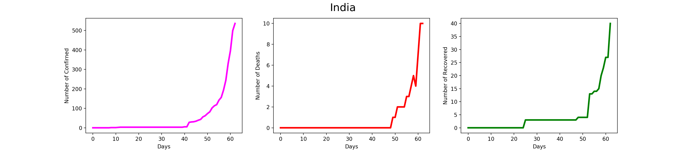
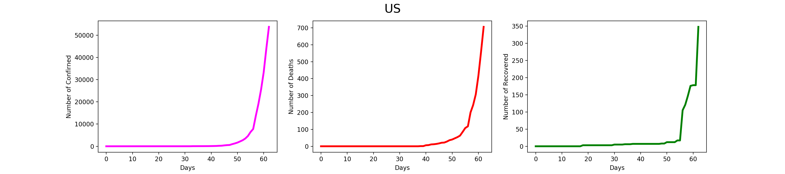

# Covid-19 Dataset (updated upto 25th March' 2020 and V2 updated upto 3rd August)
This repositary contains dataset of COVID-19 country wise trend and weather data.
Each country contains seperate csv file (178 countries).
The data consists of date, country, confirmed cases, recovered cases, total death. We have combined the data with weather data (source: https://darksky.net/) consists of humidity, dew, ozone, perception, max temperature, minimum temperature, and UV. We have considered mean and standard deviation over different cities of a country.

# Note on V2 data
V2 contains only trend data as we found that the weather does not contribute much in prediction

# Sample Trend (India)

# Sample Trend (US)

# Citation

If you use these models in your research, please cite:

    @article{pal2020neural,
      title={Neural network based country wise risk prediction of COVID-19},
      author={Pal, Ratnabali and Sekh, Arif Ahmed and Kar, Samarjit and Prasad, Dilip K},
      journal={Appl. Sci.},
      year={2020}
    }

